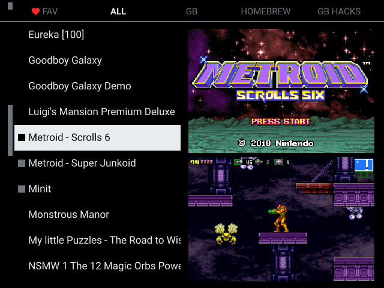
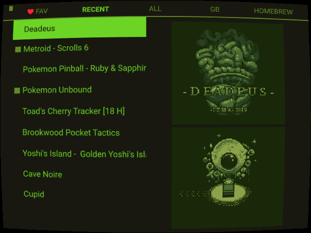

# Pegasus Boy Lite
Pegasus Boy Lite is a theme for [Pegasus Frontend](https://pegasus-frontend.org) based on [Pegaus Boy by gtaforever00](https://github.com/gtaforever00/pegasus-boy).  It features a minimal interface that prioritizes the game list and images with settings to tweak the layout how you like.

## Installation
Download the [latest release](https://github.com/tap0119/PegasusBoyLite/releases/tag), extract and place in the resulting folder your Pegasus theme directory. In Pegasus, select the theme in the settings menu.

## Assets
This theme is designed to use the following assets. To get the most out of this theme, it is reccomended you have a Screenshot, and at least one of the titlescreen or boxart for each game. 

- Titlescreen
- Boxart (boxfront)
- Screenshot

For information on assets see [Assets in the Pegasus Docs](https://pegasus-frontend.org/docs/user-guide/meta-assets/)

## Features
- Minimal interface
- Large image display
- Switch between titlescreen and boxart with a button
- Enlarge images with a button
- Settings to control the layout and theme
- Toggleable clock, game counter, and battery
- Toggleable menu sounds
- Favorites Menu
- Last Played Menu
- Shaders providing a CRT look

## Controls
Dpad              - Navigate
L1/R1             - Move Menu tabs
L2/R2             - Move up or down 10 rows in the Main List

(A) Accept        - Launch Game
(B) Back          - Enlarge images
(X) Game Details  - Switch between the Title screen and Box Art image 
(Y) Filter        - Favorite game

## Screenshots

## License

Distributed under the GNU General Public License v3.0+. See [COPYING](COPYING) for more information.

## Acknowledgements

- [Pegaus Boy by gtaforever00](https://github.com/gtaforever00/pegasus-boy)
- [Pegasus](https://pegasus-frontend.org/)
- [Libretro shaders](https://github.com/libretro/slang-shaders)
- [Libretro assets](https://github.com/libretro/retroarch-assets)
  License: [CC BY 4.0](assets/retroarch-assets/COPYING)
- [Hack font](https://github.com/source-foundry/Hack)
  License: [MIT License](assets/fonts/Hack/LICENSE.md)

